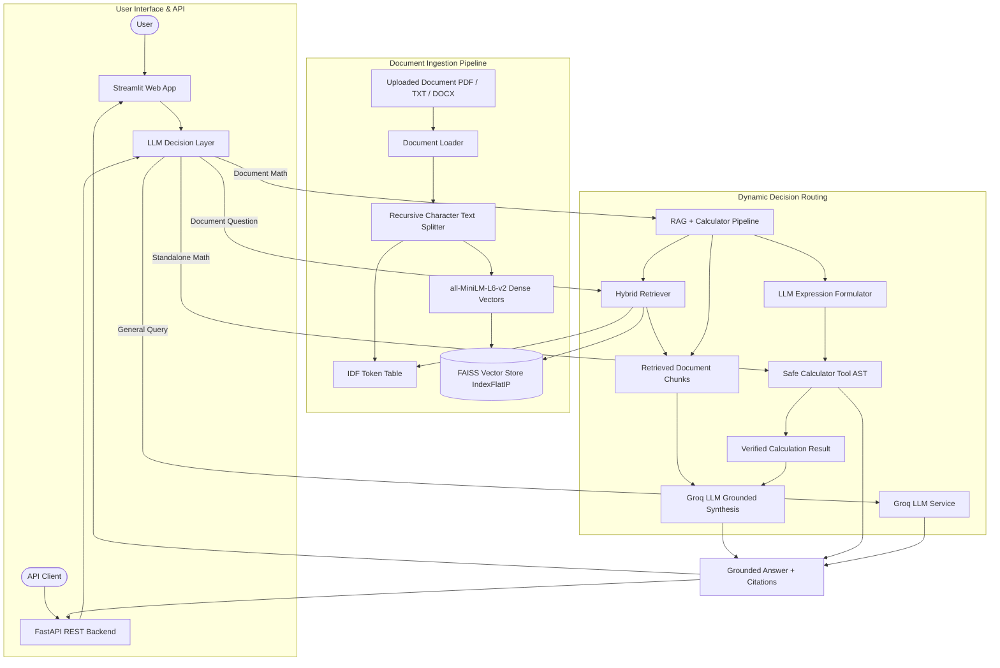

# AI Document Assistant
### RAG + Safe Calculator Tool + LLM Decision Layer

An end-to-end, production-ready AI Document Assistant designed for the **Day 14 Final Capstone Demonstration**. The system combines Retrieval-Augmented Generation (RAG) over uploaded documents with an intelligent LLM Decision Layer that dynamically routes queries between dense/sparse hybrid document search, a sandboxed safe mathematical calculator tool, multi-step RAG + Calculator workflows, and direct LLM responses.

---

## 📌 Project Overview

In real-world enterprise scenarios, users do not just ask static factual questions about documents—they also ask for high-level summaries, simplified explanations, and quantitative reasoning (such as calculating percentages, headcount allocations, or financial totals based on facts stated in the text).

Standard LLMs frequently hallucinate facts or produce arithmetic errors when calculating mentally. **AI Document Assistant** solves this by:
1. **Grounding answers strictly in ingested documents** (PDF, TXT, DOCX) via FAISS vector retrieval and keyword scoring.
2. **Delegating mathematical calculations to a verified, sandboxed AST Calculator Tool** rather than relying on LLM arithmetic.
3. **Using an LLM Decision Layer** that analyzes user intent and orchestrates multi-step tool execution when a question requires both document retrieval and mathematical computation.

---

## ✨ Features

- **Multi-Format Document Ingestion**: Supports `.pdf` (via `pypdf`), `.txt` (with multi-encoding fallback), and `.docx` (via `python-docx`).
- **Recursive Character Text Chunking**: Hierarchical recursive text splitting (`["\n\n", "\n", ". ", " ", ""]`) using `RecursiveCharacterTextSplitter` with configurable chunk size (800 chars) and overlap (150 chars) to prevent orphaned heading fragments and preserve semantic continuity.
- **Dense Vector Search with all-MiniLM-L6-v2**: High-speed dense embeddings using `all-MiniLM-L6-v2` (384-dimensional normalized vectors) with CPU and CUDA auto-selection. Indexed in `faiss-cpu` (`IndexFlatIP`).
- **Hybrid Retrieval System**: Combines semantic cosine similarity (70% weight) and IDF-weighted token frequency matching (30% weight) to maximize recall on both conceptual and exact keyword queries.
- **LLM Decision Layer**: Dynamically determines the required toolchain:
  - `CALCULATOR`: Direct arithmetic calculations.
  - `RAG`: Document-based questions, explanations, summaries, and key points.
  - `RAG_AND_CALCULATOR`: Questions requiring document context retrieval followed by verified mathematical calculation.
  - `DIRECT_LLM`: General knowledge or open-ended inquiries.
- **Safe Sandboxed Calculator**: Abstract Syntax Tree (`ast`) based mathematical evaluator supporting `+`, `-`, `*`, `/`, `%`, `**`, parentheses, and percentage normalization (`15%` $\to$ `0.15`). Completely disallows arbitrary code execution, system calls, or builtins.
- **Strictly Grounded Responses**: Prompts enforce zero hallucination. If a fact is absent from the document, the system explicitly reports that the information was not found.
- **Transparent Citations & Diagnostics**: Displays source filenames, chunk IDs, semantic similarity scores, keyword scores, hybrid scores, and calculator execution breakdowns in the UI.
- **Production FastAPI Backend API**: Complete REST API with interactive Swagger documentation (`/docs`), automated health checks, embedding generation, text splitting, document uploading, hybrid search, AST calculator evaluation, and agent chat.
- **Interactive Streamlit UI**: Modern interface with document upload, sample document selector, index status monitoring, one-click demo presets, and real-time execution diagnostics.

---

## 🏗️ Architecture



---

## 🛠️ Tech Stack

| Technology | Purpose |
| :--- | :--- |
| **Python 3.10+** | Core programming language |
| **FastAPI 0.110+ & Uvicorn** | High-performance backend REST API |
| **Streamlit 1.64+** | Interactive web application framework and UI |
| **Groq API** | High-performance LLM inference (`openai/gpt-oss-20b`, `llama-3.3-70b-versatile`) |
| **all-MiniLM-L6-v2** | Fast, lightweight dense semantic embedding model (`all-MiniLM-L6-v2`, 384 dimensions) |
| **LangChain Text Splitters** | `RecursiveCharacterTextSplitter` for hierarchical document chunking |
| **FAISS CPU** | High-speed vector index and cosine similarity search |
| **NumPy** | Array manipulations and vector normalization |
| **PyPDF & Python-Docx** | Text extraction from PDF and Word documents |
| **Pytest** | Automated unit and integration testing suite |
| **Python-Dotenv** | Secure environment variable configuration |

---

## 📁 Project Structure

```text
Final Task/
├── app.py                      # Main Streamlit web application
├── run_api.py                  # Entrypoint to run FastAPI backend server
├── requirements.txt            # Project dependencies
├── README.md                   # Complete documentation & architecture
├── .env.example                # Template for environment configuration
├── .env                        # Local secrets (ignored by git)
├── .gitignore                  # Git ignore rules
│
├── app/
│   ├── __init__.py             # Package marker
│   ├── api.py                  # FastAPI REST API backend endpoints & schemas
│   ├── config.py               # Paths, parameters, and environment validation
│   ├── llm_service.py          # Groq LLM integration with reasoning fallbacks
│   ├── calculator_tool.py      # Safe AST-based mathematical evaluator
│   ├── document_loader.py      # Universal loader for PDF, TXT, and DOCX
│   ├── chunker.py              # Recursive Character Text Splitter (langchain-text-splitters)
│   ├── embeddings.py           # all-MiniLM-L6-v2 integration with dynamic dimension detection
│   ├── vector_store.py         # FAISS vector store with IDF table & persistence
│   ├── retriever.py            # Hybrid retriever (Dense + Sparse keyword)
│   ├── rag_pipeline.py         # Grounded RAG execution & prompt construction
│   ├── document_search_tool.py # Modular tool interface for search
│   └── decision_layer.py       # LLM Decision Layer & multi-tool orchestrator
│
├── data/
│   └── documents/              # Preloaded sample documents & workforce reports
│       ├── company_workforce_report.txt
│       ├── company_remote_work_policy.txt
│       ├── BCG_Feb_2011_English_CE.txt
│       ├── transformers.txt
│       ├── rag_fundamentals.txt
│       └── KalashSoni_resume.pdf
│
├── storage/                    # Persisted FAISS index and chunks cache
│   ├── index.faiss
│   └── chunks.pkl
│
└── tests/
    ├── conftest.py             # Pytest configuration
    ├── test_agent.py           # Agent and RAG unit & integration tests
    └── test_api.py             # Backend FastAPI endpoint integration tests
```

---

## 🚀 Installation & Setup

### 1. Clone the repository and navigate to the project directory:

```bash
git clone <repository-url>
cd "Final Task"
```

### 2. Create and activate a Python virtual environment:

```bash
# Windows
python -m venv .venv
.venv\Scripts\activate

# macOS / Linux
python3 -m venv .venv
source .venv/bin/activate
```

### 3. Install required dependencies:

```bash
pip install -r requirements.txt
```

### 4. Configure environment variables:

Copy `.env.example` to `.env`:

```bash
cp .env.example .env
```

Open `.env` and set your Groq API key:

```env
GROQ_API_KEY=gsk_your_actual_groq_api_key_here
GROQ_MODEL=openai/gpt-oss-20b
EMBEDDING_MODEL=all-MiniLM-L6-v2
TOP_K=3
SIMILARITY_THRESHOLD=0.35
HYBRID_ALPHA=0.7
```

---

## ▶️ Running the Application

### Option A: Launch the Streamlit Web Application

```bash
streamlit run app.py
```

The application will open automatically in your browser at:
`http://localhost:8501`

### Option B: Launch the FastAPI Backend API Server

Run the backend REST API:

```bash
python run_api.py
```
Or via uvicorn directly:
```bash
python -m uvicorn app.api:app --host 0.0.0.0 --port 8000 --reload
```

- **Interactive Swagger Documentation**: `http://localhost:8000/docs`
- **ReDoc Documentation**: `http://localhost:8000/redoc`

#### Key API Endpoints:

| Method | Endpoint | Description |
| :--- | :--- | :--- |
| `GET` | `/api/health` | System health, vector store state & embedding model info |
| `GET` | `/api/models` | Diagnostic parameters for all-MiniLM-L6-v2 & LLM |
| `POST` | `/api/embed` | Generate dense vector embeddings using all-MiniLM-L6-v2 |
| `POST` | `/api/split` | Preview text chunking via Recursive Character Text Splitter |
| `POST` | `/api/documents/upload` | Upload `.pdf`, `.txt`, `.docx` to chunk & index in FAISS |
| `POST` | `/api/documents/index-text` | Directly index raw text into vector store |
| `GET` | `/api/documents/status` | Current document and indexed chunk count |
| `DELETE` | `/api/documents/clear` | Clear indexed document chunks |
| `POST` | `/api/search` | Dense + sparse hybrid document retrieval |
| `POST` | `/api/chat` (or `/api/ask`) | Full AI Assistant flow (Decision layer: Math, RAG, or Hybrid) |
| `POST` | `/api/calculator` | Standalone AST calculator evaluation |

---

## 🧪 Running Automated Tests

Run the full automated test suite verifying calculator safety, document loading, chunking, hybrid retrieval, and decision layer routing:

```bash
python -m pytest tests/test_agent.py -v
```

All 6 test suites validate:
- Safe mathematical execution & division by zero prevention.
- Security sandboxing preventing arbitrary code or file access.
- Text, PDF, and in-memory byte extraction.
- Paragraph-aware chunking and FAISS vector indexing.
- Document-level meta query retrieval ("Explain this in simple words", "Give key points").
- Decision Layer routing and fast-path execution.

---

## 🎯 Capstone Demonstration Guide

Follow this step-by-step workflow during the capstone demonstration:

### Step 1: Open the Application
Run `streamlit run app.py` and open the web interface.

### Step 2: Ingest a Document
1. In the sidebar under **Document Ingestion**, select `company_workforce_report.txt` from the dropdown (or upload any PDF/TXT/DOCX file).
2. Click **⚡ Process & Index Document**.
3. Observe the live status indicators:
   - Text extracted & cleaned
   - Semantic chunks generated
   - Embeddings computed via `all-MiniLM-L6-v2`
   - FAISS index ready

---

### Step 3: Run Demo Queries

#### Test Case 1: High-Level Explanation
- **User Query**:
  ```text
  Explain this in simple words
  ```
- **Execution Route**: `RAG (Document Search)`
- **Component**: `DecisionLayer` $\to$ `HybridRetriever` $\to$ `RAGPipeline` $\to$ `Groq LLM`
- **Expected Output**:
  A plain-language summary stating that Acme Corporation has 500 employees, 15% work remotely full-time, the largest team is Engineering, and remote employees receive 24 days of paid leave.
- **Sources**: `company_workforce_report.txt` (Chunk 1 & Chunk 2).

---

#### Test Case 2: Key Points Extraction
- **User Query**:
  ```text
  Give key points
  ```
- **Execution Route**: `RAG (Document Search)`
- **Component**: `DecisionLayer` $\to$ `HybridRetriever` $\to$ `RAGPipeline` $\to$ `Groq LLM`
- **Expected Output**:
  A clean bulleted list highlighting total workforce (500), remote work percentage (15%), engineering division size (250 employees), and satisfaction ratings (92%).
- **Sources**: `company_workforce_report.txt` (Chunk 1 & Chunk 2).

---

#### Test Case 3: Standalone Calculator Tool
- **User Query**:
  ```text
  25 * 8
  ```
- **Execution Route**: `Calculator`
- **Component**: `DecisionLayer` $\to$ `SafeCalculator (AST)`
- **Expected Output**:
  ```text
  Calculation Result:
  25 * 8 = 200
  ```
- **Tool Activity**: Shows evaluated expression `25 * 8`, verified result `200`, and AST sandboxing details.

---

#### Test Case 4: Document Fact + Calculator (Multi-Step Tool Workflow)
- **User Query**:
  ```text
  The document says there are 500 employees. If 15% work remotely, how many employees work remotely?
  ```
- **Execution Route**: `RAG + Calculator`
- **Workflow**:
  1. `HybridRetriever` retrieves chunk: *"the company has 500 employees worldwide. Out of the total workforce, exactly 15% work remotely..."*
  2. `DecisionLayer` formulates mathematical expression: `500 * 0.15`.
  3. `SafeCalculator` evaluates expression: `75`.
  4. `Groq LLM` synthesizes the final grounded answer.
- **Expected Output**:
  - Explains that the document confirms 500 employees and a 15% remote workforce.
  - Highlights the calculator calculation: `500 * 0.15 = 75`.
  - Concludes that exactly **75 employees** work remotely.
- **Tool Activity**: Displays Formula `500 * 0.15`, Result `75`.
- **Sources**: `company_workforce_report.txt` (Chunk 1).

---

#### Test Case 5: Out-of-Scope / Non-Hallucination Query
- **User Query**:
  ```text
  What is the recipe for chocolate cake?
  ```
- **Execution Route**: `RAG (Document Search)`
- **Expected Output**:
  ```text
  I could not find relevant information in the uploaded document to answer this question.
  ```
- **Verification**: Confirms that the system does not invent information when facts are absent from the document.

---

## ⚙️ How the Components Work

### 1. Document Ingestion & Chunking
`DocumentLoader` reads files into UTF-8 text. `TextChunker` breaks documents into coherent sections (~180 words) with a 35-word sliding window. This preserves paragraph boundaries and eliminates isolated title fragments.

### 2. Embeddings & FAISS Vector Index
Chunks are passed to `sentence-transformers/all-MiniLM-L6-v2`. Embeddings are normalized to unit length so that inner product (`IndexFlatIP`) computes exact cosine similarity.

### 3. Hybrid Retrieval
`HybridRetriever` combines dense semantic search and sparse IDF keyword matching:
$$\text{Score} = 0.70 \times \text{Semantic Score} + 0.30 \times \text{Keyword Score}$$
Candidates with $\text{Score} < 0.35$ are filtered out. For document-level meta queries ("Explain this", "Give key points"), query expansion and introductory chunk retrieval ensure comprehensive summaries.

### 4. LLM Decision Layer
The decision layer inspects query syntax and semantics:
- Pure math strings bypass LLM classification for sub-millisecond execution.
- Complex natural language queries are classified via structured JSON from the LLM.
- If a query requires both document facts and arithmetic, the multi-step `RAG_AND_CALCULATOR` pipeline executes sequentially.

### 5. Safe Calculator Tool
Mathematical expressions are parsed into Python's Abstract Syntax Tree (`ast`). Only arithmetic operators, numbers, and unary signs are visited. Variable lookup, function execution, and arbitrary imports are strictly blocked.

---

## ⚠️ Limitations & Future Work

- **OCR for Scanned Documents**: PDFs with scanned images require an OCR pre-processor like Tesseract.
- **Multi-Document Disambiguation**: Cross-document entity resolution can be enhanced with rerankers (e.g. `bge-reranker-large`).
- **Context Window Constraints**: Extremely long documents (100+ pages) benefit from hierarchical summarization (Map-Reduce RAG).
